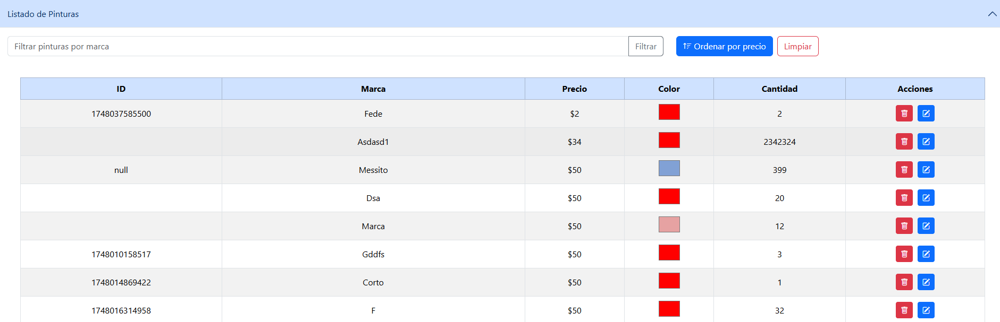
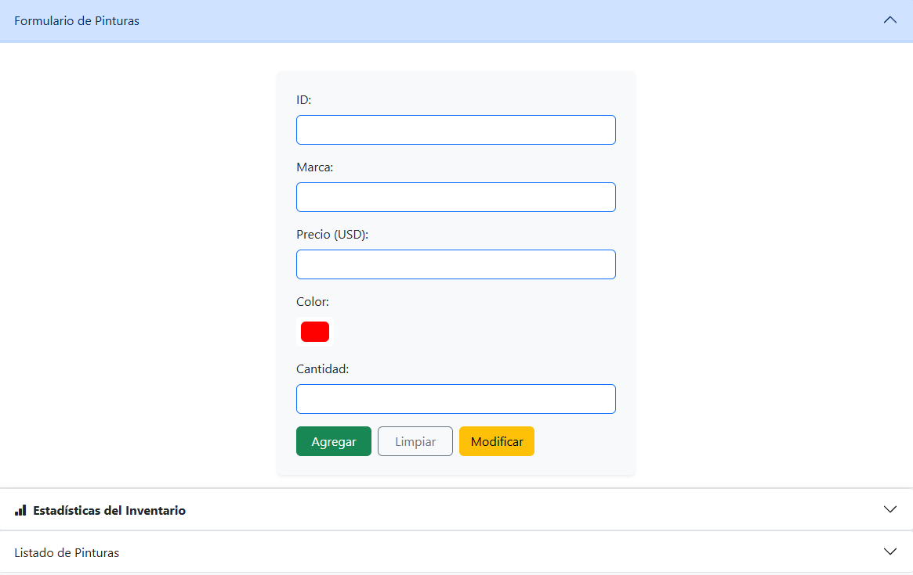
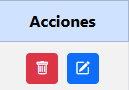
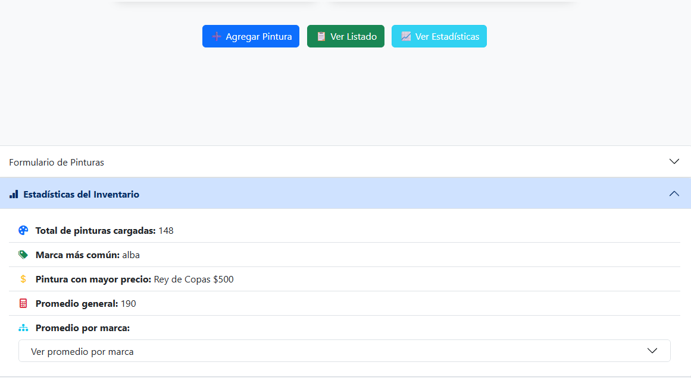
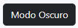

# Sistema de Gestión de Pinturas

Esta aplicación web permite administrar un inventario de pinturas, con funcionalidades para agregar, modificar, eliminar, filtrar y ordenar los registros, además de generar estadísticas y exportar datos.

## 🎨 Funcionalidades Principales

### Gestión de Inventario
- **Listado de pinturas**: Muestra una tabla con las pinturas disponibles incluyendo ID, marca, precio, color y cantidad


- **Agregar pintura**: Permite ingresar una nueva pintura validando datos antes de enviarlos al servidor


- **Modificar pintura**: Carga los datos de una pintura seleccionada para editarla y actualizarla en la base de datos utiliza el mismo formulario pero antes debe seleccionarse en el cuadro la pintura a modificar.



- **Eliminar pintura**: Permite eliminar una pintura con confirmación previa 


### Herramientas de Búsqueda y Organización
- **Filtrado**: Filtra la lista de pinturas por marca ingresada en un campo de búsqueda
- **Ordenar por precio**: Alterna entre orden ascendente y descendente según el precio

### Análisis y Exportación
- **Estadísticas**: Muestra total de pinturas, marca más frecuente, pintura más cara, y promedios generales y por marca (al clickear se actualiza en tiempo real y carga los nuevos elementos para recalcular las estadisticas)



- **Exportar CSV**: Exporta la lista actual de pinturas a un archivo CSV descargable


### Personalización
- **Modo oscuro**: Permite activar/desactivar un tema oscuro que se guarda en localStorage para mantener la preferencia



## 🛠️ Tecnologías Utilizadas

- **JavaScript moderno** (async/await, fetch API)
- **Bootstrap y CSS** para estilos y componentes UI
- **API REST externa** para persistencia de datos
- **localStorage** para preferencias del usuario

## 🌐 API

La aplicación utiliza la API REST disponible en:
```
https://utnfra-api-pinturas.onrender.com/pinturas
```

## 🚀 Cómo Usar

1. **Inicio**: Cargar la página para mostrar el listado de pinturas(Recomiendo live Share extension en visual studio)
2. **Gestión**: Utilizar el formulario para agregar o modificar pinturas
3. **Herramientas**: Usar los botones para filtrar, ordenar, exportar y ver estadísticas
4. **Personalización**: El modo oscuro puede activarse con el botón correspondiente y se recordará en futuras visitas

## 📋 Requisitos

- Navegador web moderno con soporte para ES6+
- Conexión a internet para acceder a la API
- Bootstrap CDN para los estilos

## 🔧 Instalación

1. Clonar o descargar el repositorio
2. Abrir el archivo `index.html` en un navegador web
3. La aplicación se conectará automáticamente a la API externa

## 📊 Funciones de Estadísticas

La aplicación proporciona análisis detallados incluyendo:
- Total de pinturas en inventario
- Marca más frecuente
- Pintura con mayor precio
- Promedios de precio general y por marca

## 💾 Exportación de Datos

Los datos pueden exportarse en formato CSV para su uso en otras aplicaciones como Excel o Google Sheets.

## 🌙 Modo Oscuro

El tema oscuro mejora la experiencia visual en condiciones de poca luz y la preferencia se mantiene entre sesiones gracias al almacenamiento local.